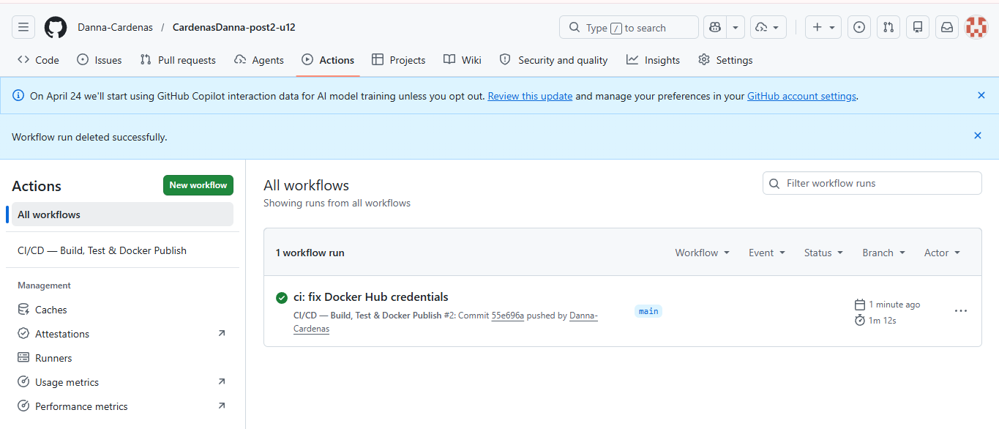
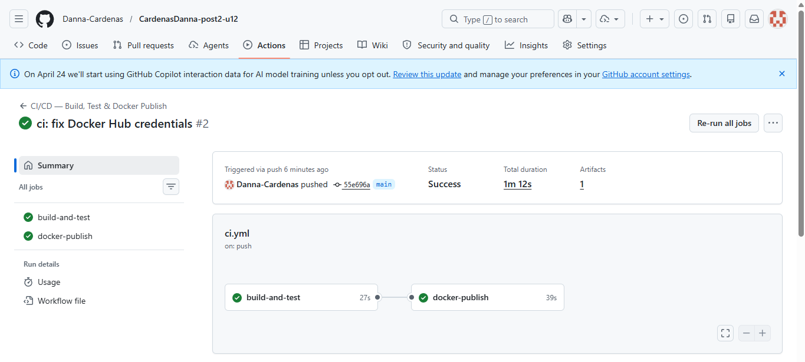
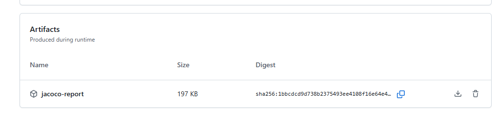
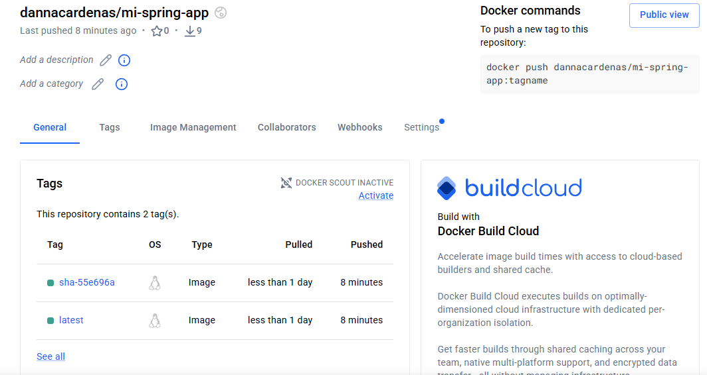

# CardenasDanna-post2-u12

Aplicación Spring Boot con pipeline CI/CD usando GitHub Actions y Docker Hub.

## GitHub Secrets requeridos
 
Para que el pipeline funcione se deben configurar estos secrets en **Settings → Secrets and variables → Actions**:
 
| Secret | Descripción |
|--------|-------------|
| `DOCKERHUB_USERNAME` | Usuario de Docker Hub (ej: dannacardenas) |
| `DOCKERHUB_TOKEN` | Access Token generado en Docker Hub → Account Settings → Security |

## Pipeline CI/CD
1. Compilar con Maven y ejecutar pruebas (JaCoCo)
2. Publicar reporte como artefacto
3. Construir imagen Docker y publicar en Docker Hub

## Imagen Docker
 
La imagen está publicada en Docker Hub y se puede descargar con:
 
```bash
docker pull dannacardenas/mi-spring-app:latest
```
 
Ejecutar localmente:
 
```bash
docker run -p 8080:8080 \
  -e SPRING_PROFILES_ACTIVE=dev \
  dannacardenas/mi-spring-app:latest
```

## Evidencias del pipeline
 
### Historial de GitHub Actions — Ejecuciones exitosas

 
### Detalle del workflow — Jobs en verde

 
### Reporte JaCoCo como artefacto descargable

 
### Docker Hub — Imagen publicada con tags
